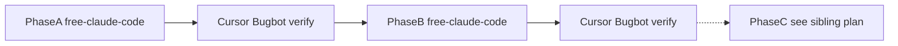

<!-- date: 2026-08-06 -->
<!-- source: chat:bugcheck-realtime-translate · user: split living plan A/B vs Phase C -->
<!-- note: splits from plan/plan-2026-08-06-bugfix-and-phase4-realtime-translate.md (now SUPERSEDED stub) -->

# Plan: Bugfix Phase A + Phase B — Realtime Translate JP To VN

> **Split từ** `plan/plan-2026-08-06-bugfix-and-phase4-realtime-translate.md` (combined → stub SUPERSEDED).  
> **Thay thế** `plan/plan-2026-08-05-realtime-translate-jp-to-vn.md` (Phase 1-3 ✅ done — đóng). Kế thừa: scipy pin, `is_final` contract, MPS default.  
> Căn cứ: `review/codebase-bugcheck-2026-08-06.md` + Bugbot 2026-08-06 (5 findings = A1–A5 vẫn open trên disk).  
> **Phase C (latency)** sống riêng: [`plan/plan-2026-08-06-phase4-latency.md`](plan-2026-08-06-phase4-latency.md).

## Nguyên tắc (ponytail)
- Fix nhỏ nhất đúng root cause; không thêm dependency, không thêm abstraction.
- Mỗi fix có 1 runnable check (assert smoke / test unit). Test chạy full suite trước + sau mỗi phase.
- Plan là living document — khi reality đổi, update plan trong file này (AGENTS §1).
- Flash model có thể nửa-vời: **sau A và sau B bắt buộc Cursor/Bugbot verify** — không tin Flash tự tick plan đúng.

## Phân công AI (locked 2026-08-06) — A/B only

| Phase | Executor | Model | Ghi chú |
|-------|----------|-------|---------|
| **A** Bugfix P0/P1 | **free-claude-code** | DeepSeek V4 Flash (default của free-claude-code) | Plan locked A1–A6; harness Claude Code + cùng model Flash |
| **B** Gap + docs | **free-claude-code** | DeepSeek V4 Flash | Chỉ sau A xanh + verify |
| Verify sau A / sau B | **Cursor + Bugbot** | — | So diff với plan; không để Flash tự đóng mốc |
| Alternate A/B (nếu free-claude-code không dùng được) | Antigravity | Gemini **3.6 Flash High** | Chỉ iterate nhanh; vẫn verify bằng Cursor/Bugbot |

**Phase C** (latency / đổi engine) → sibling plan [`plan-2026-08-06-phase4-latency.md`](plan-2026-08-06-phase4-latency.md) — Antigravity + Gemini 3.1 Pro High; không nằm trong file này.

Thứ tự gate: **A → verify → B → verify** (stop; C chỉ khi A+B merge + tests pass — xem sibling plan).



---

## Phase A — Bugfix quick wins (P0/P1, ~1 buổi)

**Executor:** free-claude-code (DeepSeek V4 Flash).  
**Thứ tự fix:** A1 → A3 → A2 → A5 → A4 → A6.  
**Check cuối:** `cd local-bridge && python -m unittest tests.test_pipeline`.

### A1. Offload ASR/MT khỏi event loop — `local-bridge/app/api/endpoints.py`
- **Bug (§2.1, CONFIRMED đo + Bugbot high):** `async def websocket_translate` gọi blocking `transcribe()`/`translate()` trên event loop → /health treo 23.6s khi có 1 luồng WS.
- **Fix (locked):** `await asyncio.to_thread(...)` quanh mọi blocking call — WS `audio_chunk` (ASR+MT), WS `text`, REST `/api/translate`. Không đổi handler sang sync `def`.
- **Check:** mock `transcribe` sleep 0.5s trong lúc WS đang chạy; GET `/health` <1s.
- [x] done

### A2. Dọn partial cards khi finalize — `web/index.html`
- **Bug (§2.2 + Bugbot medium):** chỉ xóa card cuối → utterance nhiều window để lại partial giữa câu.
- **Fix (locked):** `data-partial-group` trên mỗi partial pair; khi `is_final` xóa cả nhóm rồi append 1 card final. Reset group khi mic start / gửi text.
- **Check:** 2 partial + 1 final → transcript chỉ còn 1 card cho utterance đó.
- [x] done

### A3. Kill feedback loop mic→loa — `web/index.html`
- **Bug (§2.3 + Bugbot medium):** `scriptProcessor.connect(audioContext.destination)` phát mic ra loa.
- **Fix (locked):** connect qua `GainNode` `gain.value = 0`. Giữ `onaudioprocess` (meter vẫn chạy).
- **Check:** mở mic, không echo; meter vẫn chạy.
- [x] done

### A4. Sample rate contract — `web/index.html` + `local-bridge/app/api/endpoints.py`
- **Bug (§2.4 + Bugbot medium):** client không gửi `sample_rate`; server luôn dùng `config.sample_rate` (16k); browser có thể 44.1k/48k.
- **Fix (locked):**
  - Client: `sample_rate: audioContext.sampleRate` trên mọi `audio_chunk` (kể cả flush final).
  - Server: đọc field; nếu ≠ 16000 → `WARNING:bridge:` **một lần / WS session**; resample chunk về 16k bằng numpy linear interp **trước** `add_float32`; `AudioBufferManager` giữ 16000.
  - Không thêm dependency; không reject chunk.
- **Check:** gửi chunk 48k → WARNING 1 lần, pipeline vẫn trả kết quả.
- [x] done

### A5. ASR `load_failed` flag + engine badge — `local-bridge/app/services/asr_service.py` + `web/index.html`
- **Bug (§2.5 + Bugbot medium):** retry `load_model` mỗi window khi fail (spam errors.log); fallback mock âm thầm.
- **Fix (locked):** `load_failed` → không gọi `load_model` lại; `engine_name` kiểu `fallback-asr (load failed)`. UI GET `/api/status` khi connect → badge `ASR: … · MT: …`.
- **Check:** fail load 2 lần → chỉ 1 WARNING; badge hiện engine state.
- [x] done

### A6. Dọn dead code + nhỏ nhặt — đa file
- Xóa: `vad_service.filter_silence`; `AudioChunkMessage` nếu không còn reference; config `chunk_duration_sec` / `min_speech_duration_sec`; `AudioBufferManager.silence_count`.
- `confidence`: schema `Optional[float] = None`; ngừng hardcode 0.95/1.0.
- `itemCounter` chỉ tăng khi `is_final`.
- Dict fast-path: strip `。、！？` trước exact-match (`translation_service.py`).
- **Check:** full test suite pass.
- [x] done

---

## Phase B — Gap nhỏ + docs (1 buổi)

**Executor:** free-claude-code (DeepSeek V4 Flash).  
**Gate:** Phase A checkbox + mốc A đã tick **và** Cursor/Bugbot verify A OK.  
**Không làm:** Phase C / đổi ASR engine (xem [`plan-2026-08-06-phase4-latency.md`](plan-2026-08-06-phase4-latency.md)).  
> Reality-sync (2026-08-06, sau khi B ship): mlx-whisper đã land trên disk (Phase C) — ASR engine = mlx-whisper-small-mlx, README phase-table row 4 đã update "✅ done". Phase B không đụng ASR engine — không revert.

- **B1. Nút copy text** transcript JA + VI — `web/index.html`, 1 nút copy per card + copy all.
- **B2. Golden audio** — `testdata/audio/konnichiwa-16k.wav` + regression test với fixture (ffmpeg TTS hoặc thu thật; 16k mono).
- **B3. Tách test ASR chậm** — mock whisper trong unit test nhanh; giữ 1 integration test dùng fixture thật (§4.4).
- **B4. 3 skill còn trống** — viết `skills/local-bridge/SKILL.md`, `skills/realtime-translate/SKILL.md`, `skills/realtime-regression/SKILL.md` (AGENTS §5).
- **B5. README stale** — sửa dòng "walkthrough (đang skeleton)" → đã đầy đủ.
- **B6. CORS note** — `allow_origins=["*"]` + credentials: bỏ `allow_credentials` **hoặc** note rõ rủi ro bind `0.0.0.0` (local dev — chấp nhận). Locked default: bỏ `allow_credentials=True` trong `main.py` (combo với `*` vô hiệu anyway).
- **Check:** mỗi mục demo được thủ công; `python -m unittest tests.test_pipeline` pass.
- [x] B1–B6 done — ngày: 2026-08-06 · 8/8 tests pass (1.4s) · smoke: /health, /api/status, served UI có nút copy

---

## Mốc hoàn thành

- [x] Phase A: A1–A6 + tests pass — ngày: 2026-08-06 · verified Cursor/Bugbot: ____
- [x] Phase B: B1–B6 + tests pass — ngày: 2026-08-06 · verified Cursor: 2026-08-06 (disk check B1–B6 + 8/8 tests)
- [x] Plan A/B đóng — A+B land 2026-08-06 (Phase C sibling đã đóng riêng)

## Out of scope

- Phase C latency / đổi ASR engine — [`plan-2026-08-06-phase4-latency.md`](plan-2026-08-06-phase4-latency.md).
- M2M100/NLLB thay MarianMT — chưa phải bây giờ.
- Docker/cloud deploy, multi-user auth — local-first giữ nguyên.

---

## Appendix — Handoff prompts

### Prompt A — Phase A · free-claude-code (DeepSeek V4 Flash)

```text
Bạn là lazy senior (ponytail). Fix Phase A bugfix cho repo Realtime Translate JP To VN.

BẮT BUỘC trước khi sửa:
1. Đọc AGENTS.md (§0 ponytail, §2 disk wins, §6 errors.log).
2. Re-read file từ disk trước mỗi fix (cache ≠ disk).
3. Living plan: plan/plan-2026-08-06-bugfix-phase-a-b.md — chỉ Phase A (A1–A6). Không làm Phase B/C.
4. Không thêm dependency, không abstraction mới, diff ngắn nhất đúng root cause.
5. Mỗi fix non-trivial: 1 smoke/unit check. Cuối: cd local-bridge && python -m unittest tests.test_pipeline.

Thứ tự: A1 → A3 → A2 → A5 → A4 → A6.

A1 endpoints.py: await asyncio.to_thread quanh transcribe/translate (WS audio, WS text, REST /api/translate). Không đổi sang sync def. Check: mock sleep 0.5s + GET /health <1s.
A3 web/index.html: GainNode gain=0 thay connect destination; meter vẫn chạy.
A2 web/index.html: data-partial-group; is_final xóa cả nhóm partial rồi 1 card final; reset group khi mic start / gửi text.
A5 asr_service.py: load_failed, không retry load; engine_name fallback rõ. UI GET /api/status → badge ASR · MT.
A4 client gửi sample_rate; server warn 1 lần/session + numpy resample về 16k TRƯỚC add_float32; buffer giữ 16000.
A6 xóa dead code (filter_silence, AudioChunkMessage nếu unused, chunk_duration_sec, min_speech_duration_sec, silence_count); confidence Optional[float]=None; itemCounter chỉ final; dict strip 。、！？.

Sau khi xong: tick checkbox A1–A6 + mốc Phase A + ghi ngày; cập nhật ngắn wiki/topics/realtime-translate.md + wiki/log.md. KHÔNG tự coi là verified — user sẽ chạy Cursor/Bugbot. Trả về: file đã sửa + kết quả test suite.
```

### Prompt B — Phase B · free-claude-code (DeepSeek V4 Flash)

```text
Bạn là lazy senior (ponytail). Làm Phase B (gap + docs) cho repo Realtime Translate JP To VN.

GATE: Chỉ làm nếu Phase A đã tick trong plan/plan-2026-08-06-bugfix-phase-a-b.md và user xác nhận Cursor/Bugbot verify A OK. Nếu A chưa xong — dừng, báo lại.

BẮT BUỘC:
1. Đọc AGENTS.md (§0, §2, §5 skills, §6, §7 feature docs nếu UI mới).
2. Re-read file từ disk. Living plan Phase B B1–B6 only. Không đụng Phase C / không đổi ASR engine (Phase C = plan/plan-2026-08-06-phase4-latency.md).
3. Không thêm dependency. Diff ngắn. Cuối: cd local-bridge && python -m unittest tests.test_pipeline.

B1 web/index.html: nút copy per card JA/VI + copy all.
B2 testdata/audio/konnichiwa-16k.wav (16k mono) + regression test dùng fixture.
B3 mock whisper trong unit test nhanh; 1 integration test fixture thật.
B4 viết 3 file: skills/local-bridge/SKILL.md, skills/realtime-translate/SKILL.md, skills/realtime-regression/SKILL.md (ngắn, actionable, khớp AGENTS §5).
B5 README: bỏ "(đang skeleton)" cho walkthrough — phản ánh reality.
B6 main.py: bỏ allow_credentials=True (giữ allow_origins local-dev) HOẶC nếu giữ thì note rõ trong README — ưu tiên bỏ credentials.

Sau khi xong: tick B1–B6 + mốc Phase B + ngày; wiki topic + log ngắn. Không tự verified — chờ Cursor/Bugbot. Trả về: file đã sửa + test result.
```

### Prompt Verify — Cursor / Bugbot (sau A và sau B)

```text
/review bugbot — verify phase vừa xong của Realtime Translate JP To VN.

Diff: uncommitted changes (hoặc branch changes nếu đã commit).
Custom Instructions: So với living plan plan/plan-2026-08-06-bugfix-phase-a-b.md.
- Sau A: đủ A1–A6 trên disk? to_thread, GainNode0, partial-group, sample_rate resample, load_failed+badge, dead code? Tests pass? Flag plan tick sai / thiếu check.
- Sau B: đủ B1–B6? copy UI, golden audio+test, mock ASR split, 3 SKILL.md, README, CORS credentials? Không được đụng Phase C (plan/plan-2026-08-06-phase4-latency.md).
Không fix — chỉ findings table. User sẽ quyết định tick mốc verified.
```
