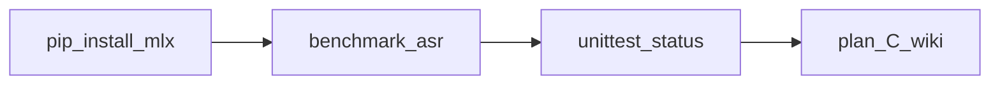

<!-- date: 2026-08-06 -->
<!-- source: chat:continue-phase-c · user: lưu plan Continue Phase C (verify + close) -->
<!-- note: living Phase C — code mlx đã land sớm; đợt này = cài deps + đo thật + đóng claim -->

# Plan: Phase C / Phase 4 latency — Realtime Translate JP To VN

> **Split từ** `plan/plan-2026-08-06-bugfix-and-phase4-realtime-translate.md` (combined → stub SUPERSEDED).  
> **Phase A + B:** [`plan/plan-2026-08-06-bugfix-phase-a-b.md`](plan-2026-08-06-bugfix-phase-a-b.md).  
> **Đợt hiện tại (2026-08-06 tối):** Continue Phase C = verify + close — bản Cursor đã lưu thêm tại [`plan/plan-2026-08-06-continue-phase-c.md`](plan-2026-08-06-continue-phase-c.md). Checklist + số đo vẫn sống ở **file này**.

## Nguyên tắc (ponytail)
- Một engine path: **mlx-whisper** (đã chọn; không song song whisper.cpp).
- Đo thật trước khi claim; không claim latency khi import fail → mock.
- Không phá contract Phase A (`to_thread`, `is_final`, sample_rate 16k, `load_failed` + badge).
- Plan living — reality đổi thì update file này (AGENTS §1).

## Phân công AI — C only

| Phase | Executor | Model | Ghi chú |
|-------|----------|-------|---------|
| **C** verify + close | **Antigravity** hoặc **Cursor** | **Gemini 3.1 Pro High** (Antigravity) / Cursor strong | **Không** Flash; **không** free-claude-code |

**Gate (nới 2026-08-06):** Phase **A** đã ship trên disk. Phase **B deferred** — không chặn C. (Gate cũ A+B+Bugbot B bỏ.)



---

## Trạng thái disk (Cursor check 2026-08-06)

- [asr_service.py](../local-bridge/app/services/asr_service.py): dùng `mlx_whisper`, map `openai/whisper-small` → `mlx-community/whisper-small-mlx`.
- [requirements.txt](../local-bridge/requirements.txt): `mlx-whisper>=0.2.0`.
- [benchmark_asr.py](../local-bridge/benchmark_asr.py): warmup + 5 iter noise 2s.
- Máy verify Cursor (sau Continue): `import mlx_whisper` OK; engine `mlx-whisper-small-mlx`; unittest 8/8.

---

## Checklist Continue (verify + close)

- [x] `python3 -m pip install -r requirements.txt` trong `local-bridge/`; `import mlx_whisper` OK
- [x] Chạy `python3 benchmark_asr.py` — ghi load_s / `engine_name` / avg_ms (mục tiêu < 1–2s)
- [x] Nếu avg > 2s: một bước model nhỏ hơn (`whisper-base-mlx` / tiny) — không thêm whisper.cpp (đã đạt < 2s)
- [x] `python3 -m unittest tests.test_pipeline` xanh; không còn ImportError mlx khi load ASR thật
- [x] `/api/status` badge hiện engine mlx
- [x] Giữ Phase A contracts (không regress)
- [x] Retick mốc Phase C + số đo thật vào plan này + wiki ingest

### Số đo (điền khi chạy)

| Metric | Giá trị |
|--------|---------|
| Baseline transformers (cũ) | ~5.8–7.9s / window (MPS) |
| Load time mlx | ~4.6 s |
| engine_name | mlx-whisper-small-mlx |
| Avg latency (5× 2s noise) | ~65.7 ms |
| Ngày đo | 2026-08-06 |

### Checklist lịch sử (code path — chưa = closed cho đến verify)

- [x] Chọn engine: mlx-whisper (`mlx-community/whisper-small-mlx`) — code landed
- [x] Baseline + post-switch latency **đo lại trên máy có mlx** (mở lại)
- [x] Model nhỏ hơn nếu vẫn &gt;2s
- [x] API `engine_name` / badge path sẵn
- [x] Test suite xanh **với** mlx installed
- [x] Phase C đóng với số đo thật

---

## Mốc hoàn thành

- [x] Phase C: latency đạt &lt;1–2s **hoặc** quyết định dừng có số đo — ngày: 2026-08-06

## Out of scope

- Phase B (copy, golden audio, skills, README, CORS) — A/B plan.
- whisper.cpp path thứ hai.
- extension/, ipad-app/, iphone-app/, macos-bridge-app/.

---

## Appendix — Handoff prompt (Continue C)

```text
Bạn là lazy senior (ponytail). Continue Phase C = verify + close mlx-whisper cho Realtime Translate JP To VN.

GATE: Phase A đã ship trên disk. Phase B deferred — không chặn. Đọc AGENTS.md + plan/plan-2026-08-06-phase4-latency.md (living).

Tình trạng: asr_service đã gọi mlx_whisper; requirements có mlx-whisper; nhưng máy có thể chưa pip install → mock. Checklist cũ tick sớm — không tin ~63ms cho đến khi đo lại.

Làm:
1. cd local-bridge && python3 -m pip install -r requirements.txt && python3 -c "import mlx_whisper; print('ok')"
2. python3 benchmark_asr.py — ghi load_s, engine_name, avg_ms vào bảng Số đo trong plan C
3. Nếu avg > 2s: một bước model nhỏ hơn (base/tiny mlx). Không song song whisper.cpp.
4. python3 -m unittest tests.test_pipeline — xanh, không ImportError mlx khi load thật
5. Kiểm tra /api/status badge mlx; không phá to_thread / is_final / sample_rate / load_failed
6. Update plan C checklist + mốc; wiki/topics/realtime-translate.md + wiki/log.md + wiki/index.md

Executor: Antigravity Gemini 3.1 Pro High hoặc Cursor. Không Flash / free-claude-code.
Pip fail → WARNING:bridge: vào errors.log, dừng, ghi blocker vào plan (không claim latency).
Trả về: import OK?, số ms, file đổi, test result.
```
